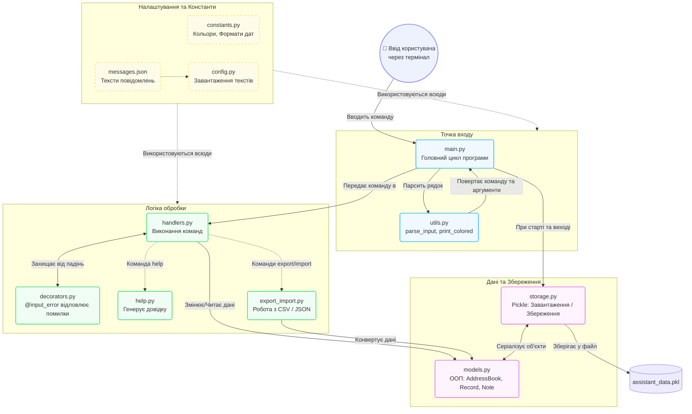

# Архітектура проєкту Matrix AI Addressbook

Ось спрощена схема життєвого циклу команди та взаємодії файлів проєкту. 

```mermaid
---
config:
  layout: fixed
---
flowchart TB
 subgraph ConfigLayer["Налаштування та Константи"]
        C1("constants.py<br>Кольори, Формати дат")
        C2("messages.json<br>Тексти повідомлень")
        C3("config.py<br>Завантаження текстів")
  end
 subgraph EntryPoint["Точка входу"]
        M("main.py<br>Головний цикл програми")
        U("utils.py<br>parse_input, print_colored")
  end
 subgraph LogicLayer["Логіка обробки"]
        H("handlers.py<br>Виконання команд")
        D("decorators.py<br>@input_error відловлює помилки")
        Help("help.py<br>Генерує довідку")
        EI("export_import.py<br>Робота з CSV / JSON")
  end
 subgraph DataLayer["Дані та Збереження"]
        Mod("models.py<br>ООП: AddressBook, Record, Note")
        S("storage.py<br>Pickle: Завантаження / Збереження")
  end
    C2 -.-> C3
    User(("👨 Ввід користувача<br>через термінал")) -- Вводить команду --> M
    M -- Парсить рядок --> U
    U -- Повертає команду та аргументи --> M
    M -- Передає команду в --> H
    H <-- Захищає від падінь --> D
    H -. Команда help .-> Help
    H -. Команди export/import .-> EI
    H -- Змінює/Читає дані --> Mod
    EI -- Конвертує дані --> Mod
    M -- При старті та виході --> S
    S <-- Серіалізує об'єкти --> Mod
    S -- Зберігає у файл --> Disk[("assistant_data.pkl")]
    ConfigLayer -. Використовуються всюди .-> EntryPoint & LogicLayer

     C1:::config
     C2:::config
     C3:::config
     M:::core
     U:::core
     H:::logic
     D:::logic
     Help:::logic
     EI:::logic
     Mod:::data
     S:::data
     User:::user
    classDef user fill:#eef2ff,stroke:#818cf8,stroke-width:2px
    classDef core fill:#f0f9ff,stroke:#38bdf8,stroke-width:2px
    classDef logic fill:#f0fdf4,stroke:#4ade80,stroke-width:2px
    classDef data fill:#fdf4ff,stroke:#e879f9,stroke-width:2px
    classDef config fill:#fefce8,stroke:#facc15,stroke-width:1px,stroke-dasharray:5 5
```
